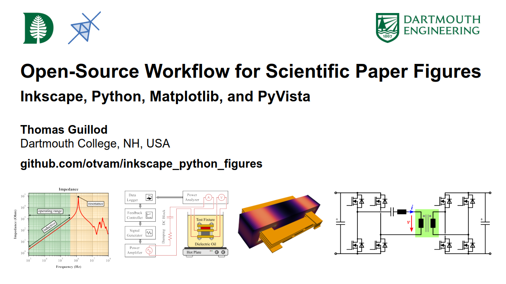
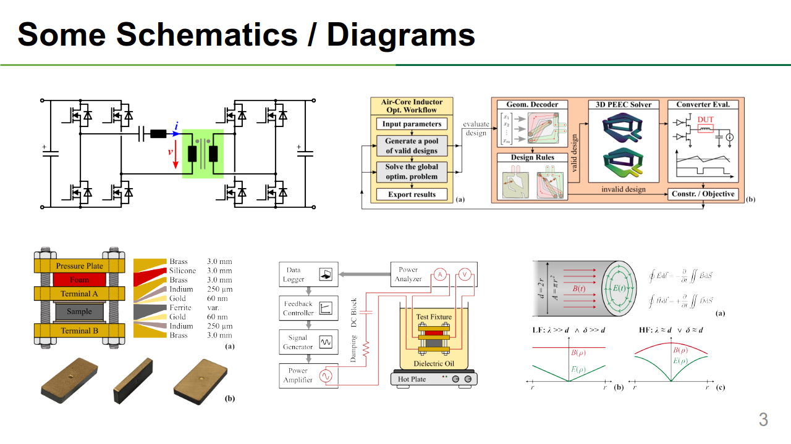
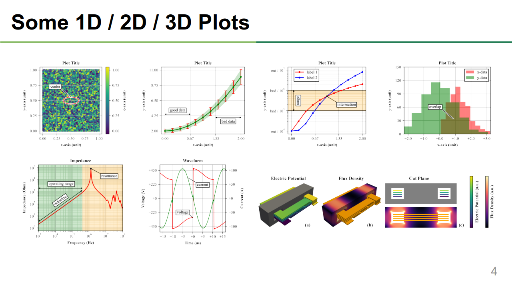

> **Note:** This is a reference fork. The original upstream repository is the actively maintained version. This fork is kept for personal reference and is not actively developed.

# Workflow for Scientific Paper Figures

## Summary

A **tutorial** for creating **publication-quality figures** with **open-source tools**:
* Focus on **electrical engineering / power electronics**
* Compatible with typical **IEEE paper format**
* **Schematics / diagrams** with Inkscape
* **Various plots** with Matplotlib
* **Mesh / FEM plots** with PyVista
* [**Slides of the tutorial**](slides.pdf)

The following open-source tools are used:
* **Inkscape** for creating and assembling figures
* **GIMP** for handling photos and images
* **LaTeX** for typesetting equations
* **Python / Matplotlib** for plots
* **Python / PyVista** for mesh/FEM plots
* **Paderborn / LEA** library for the symbols

## Some Examples

## Repository Description

* Main Files
  * [slides.pdf](slides.pdf) - Slides (PDF) of the tutorial (CC BY 4.0)
  * [slides.odp](slides.odp) - Slides (ODP) of the tutorial (CC BY 4.0)
  * [requirements.txt](requirements.txt) - List of the used Python packages.
  * [export_inkscape.sh](export_inkscape.sh) - Export PDF/PNG from Inkscape.
  * [utils_mpl.py](utils_mpl.py) - Utils functions for Matplotlib plots.
  * [utils_pv.py](utils_pv.py) - Utils functions for PyVista plots.
* Python Plots
  * [plot_line.py](plot_line.py) - Logarithmic axis and custom axis ticks.
  * [plot_error.py](plot_error.py) - Plot with error bars and error fill area.
  * [plot_hist.py](plot_hist.py) - Histogram plot with transparency.
  * [plot_cmap.py](plot_cmap.py) - Large scatter plot with a colormap.
  * [plot_meas_impedance.py](plot_meas_impedance.py) - Plot impedance measurements.
  * [plot_meas_waveform.py](plot_meas_waveform.py) - Plot oscilloscope waveforms.
  * [plot_mesh.py](plot_mesh.py) - 3D/2D plots of EM simulations.
  * [plot_notebook.ipynb](plot_cmap.py) - Plot with Jupyter notebook.
* Folders
  * [fig_schemas](fig_schemas) - Examples of Inkscape figures (schematics / diagrams).
  * [fig_plots](fig_plots) - Examples of Inkscape plots (with Python / Matplotlib).
  * [plot_data](plot_data) - Data for the example plots.
  * [img_data](img_data) - Images for the readme file.

## Compatibility

* Operating systems
  * Tested on Linux x86/64.
  * Tested on MS Windows x86/64.
  * Tested on Apple MacOS ARM64.
* Software versions
  * Tested with Python 3.12 / 3.13
  * Tested with Inkscape 1.4.1.
* Python dependencies
  * Numpy / Matplotlib
  * PyVista / Pillow
  * JupyterLab (optional)
  * List in `requirements.txt`.

## Author

* Name: **Thomas Guillod**
* Affiliation: Dartmouth College
* Email: guillod@otvam.ch
* Website: https://otvam.ch

## Copyright

> (c) 2023-2025 - Thomas Guillod
> 
>  BSD 2-Clause "Simplified" License